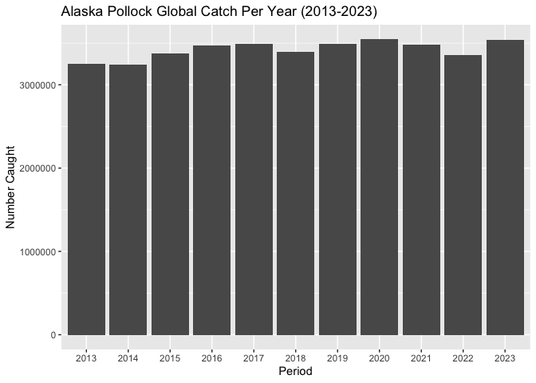

## Instructions
Answer the following questions and/or complete the exercises in RMarkdown. Please embed all of your code and push the final work to your repository. Your report should be organized, clean, and run free from errors. Remember, you must remove the `#` for any included code chunks to run.  

## Load the libraries

``` r
library("tidyverse")
library("janitor")
#library("naniar")
options(scipen = 999)
```

## About the Data
For this assignment we are going to work with a data set from the [United Nations Food and Agriculture Organization](https://www.fao.org/fishery/en/collection/capture) on world fisheries. These data were downloaded and cleaned using the `fisheries_clean.Rmd` script.  

Load the data `fisheries_clean.csv` as a new object titled `fisheries_clean`.

``` r
fisheries_clean <- read_csv("data/fisheries_clean.csv")
```

1. Explore the data. What are the names of the variables, what are the dimensions, are there any NA's, what are the classes of the variables, etc.? You may use the functions that you prefer.

``` r
glimpse(fisheries_clean)
```

```
## Rows: 1,055,015
## Columns: 9
## $ period          <dbl> 1950, 1951, 1952, 1953, 1954, 1955, 1956, 1957, 1958, …
## $ continent       <chr> "Asia", "Asia", "Asia", "Asia", "Asia", "Asia", "Asia"…
## $ geo_region      <chr> "Southern Asia", "Southern Asia", "Southern Asia", "So…
## $ country         <chr> "Afghanistan", "Afghanistan", "Afghanistan", "Afghanis…
## $ scientific_name <chr> "Osteichthyes", "Osteichthyes", "Osteichthyes", "Ostei…
## $ common_name     <chr> "Freshwater fishes NEI", "Freshwater fishes NEI", "Fre…
## $ taxonomic_code  <chr> "1990XXXXXXXX106", "1990XXXXXXXX106", "1990XXXXXXXX106…
## $ catch           <dbl> 100, 100, 100, 100, 100, 200, 200, 200, 200, 200, 200,…
## $ status          <chr> "A", "A", "A", "A", "A", "A", "A", "A", "A", "A", "A",…
```

``` r
summary(fisheries_clean)
```

```
##      period      continent          geo_region          country         
##  Min.   :1950   Length:1055015     Length:1055015     Length:1055015    
##  1st Qu.:1980   Class :character   Class :character   Class :character  
##  Median :1996   Mode  :character   Mode  :character   Mode  :character  
##  Mean   :1994                                                           
##  3rd Qu.:2010                                                           
##  Max.   :2023                                                           
##  scientific_name    common_name        taxonomic_code         catch           
##  Length:1055015     Length:1055015     Length:1055015     Min.   :       0.0  
##  Class :character   Class :character   Class :character   1st Qu.:       0.0  
##  Mode  :character   Mode  :character   Mode  :character   Median :       2.9  
##                                                           Mean   :    5089.9  
##                                                           3rd Qu.:     400.0  
##                                                           Max.   :12277000.0  
##     status         
##  Length:1055015    
##  Class :character  
##  Mode  :character  
##                    
##                    
## 
```

2. Convert the following variables to factors: `period`, `continent`, `geo_region`, `country`, `scientific_name`, `common_name`, `taxonomic_code`, and `status`.

``` r
fisheries_clean <- fisheries_clean %>% 
  mutate(across(c(period, continent, geo_region, country, scientific_name, common_name, taxonomic_code, status), as.factor))
```

##3. Are there any missing values in the data? If so, which variables contain missing values and how many are missing for each variable?

4. How many countries are represented in the data?

``` r
fisheries_clean %>% 
  summarize(distnct_count=n_distinct(country))
```

```
## # A tibble: 1 × 1
##   distnct_count
##           <int>
## 1           249
```

There are 249 countries represented in the data.

5. The variables `common_name` and `taxonomic_code` both refer to species. How many unique species are represented in the data based on each of these variables? Are the numbers the same or different?

``` r
fisheries_clean %>% 
  summarize(count=n_distinct(common_name))
```

```
## # A tibble: 1 × 1
##   count
##   <int>
## 1  3390
```

``` r
fisheries_clean %>% 
  summarize(count=n_distinct(taxonomic_code))
```

```
## # A tibble: 1 × 1
##   count
##   <int>
## 1  3722
```

Based on common name, there are 3390 unique species, based on taxonomic code there are 3722.

6. In 2023, what were the top five countries that had the highest overall catch?

``` r
fisheries_clean %>% 
  filter(period=="2023") %>% 
  group_by(country) %>% 
  summarize(overall_catch=sum(catch)) %>% 
  arrange(desc(overall_catch)) %>% 
  head(n=5)
```

```
## # A tibble: 5 × 2
##   country                  overall_catch
##   <fct>                            <dbl>
## 1 China                        13424705.
## 2 Indonesia                     7820833.
## 3 India                         6177985.
## 4 Russian Federation            5398032 
## 5 United States of America      4623694
```

The top 5 counties with the highest overall catch are China, Indonesia, India, Russian Federation, United States of America.

7. In 2023, what were the top 10 most caught species? To keep things simple, assume `common_name` is sufficient to identify species. What does `NEI` stand for in some of the common names? How might this be concerning from a fisheries management perspective?

``` r
fisheries_clean %>% 
  filter(period=="2023") %>% 
  group_by(common_name) %>% 
  summarize(n_caught=sum(catch)) %>% 
  arrange(desc(n_caught)) %>% 
  head(n=10)
```

```
## # A tibble: 10 × 2
##    common_name                    n_caught
##    <fct>                             <dbl>
##  1 Marine fishes NEI              8553907.
##  2 Freshwater fishes NEI          5880104.
##  3 Alaska pollock(=Walleye poll.) 3543411.
##  4 Skipjack tuna                  2954736.
##  5 Anchoveta(=Peruvian anchovy)   2415709.
##  6 Blue whiting(=Poutassou)       1739484.
##  7 Pacific sardine                1678237.
##  8 Yellowfin tuna                 1601369.
##  9 Atlantic herring               1432807.
## 10 Scads NEI                      1344190.
```

NEI stands for not elsewhere indicated/included. This means there are many species grouped together, not separated by species. This can be concerning because we don't know what fish are being caught.

8. For the species that was caught the most above (not NEI), which country had the highest catch in 2023?

``` r
fisheries_clean %>% 
  filter(period=="2023", common_name=="Alaska pollock(=Walleye poll.)") %>% 
  group_by(country) %>% 
  summarize(tot_catch=sum(catch)) %>% 
  arrange(desc(tot_catch))
```

```
## # A tibble: 6 × 2
##   country                               tot_catch
##   <fct>                                     <dbl>
## 1 Russian Federation                     1893924 
## 2 United States of America               1433538 
## 3 Japan                                   122900 
## 4 Democratic People's Republic of Korea    58730 
## 5 Republic of Korea                        28432.
## 6 Canada                                    5887.
```

The Russian Federation had the highest catch of Alaska pollock(=Walleye poll.) in 2023.

9. How has fishing of this species changed over the last decade (2013-2023)? Create a  plot showing total catch by year for this species.

``` r
fisheries_clean %>% 
  filter(period %in% c("2013", "2014", "2015", "2016", "2017", "2018", "2019", "2020", "2021", "2022", "2023"), common_name=="Alaska pollock(=Walleye poll.)") %>% 
  ggplot(aes(x=period, y=catch))+
  geom_col()+
  labs(title="Alaska Pollock Global Catch Per Year (2013-2023)",
       x="Period",
       y="Number Caught")
```

<!-- -->

Fishing for this species has stayed relatively the same, maybe slightly trending up, over the last decade.

10. Perform one exploratory analysis of your choice. Make sure to clearly state the question you are asking before writing any code.

I want to explore what the most fished for fish (based on common name, not including NEI) is for each of the geographical regions in the data.


``` r
fisheries_clean %>% 
  filter(!grepl("NEI", common_name)) %>% 
  group_by(geo_region, common_name) %>% 
  summarize(n_caught=sum(catch), .groups='drop') %>% 
  group_by(geo_region) %>% 
  slice_max(n_caught, n=1)
```

```
## # A tibble: 23 × 3
## # Groups:   geo_region [23]
##    geo_region                common_name                     n_caught
##    <fct>                     <fct>                              <dbl>
##  1 Australia and New Zealand Blue grenadier                  5319289.
##  2 Caribbean                 Caribbean spiny lobster         1016762.
##  3 Central America           Pacific sardine                17807309.
##  4 Central Asia              Freshwater bream                 563576.
##  5 Eastern Africa            Nile perch                     12116907.
##  6 Eastern Asia              Pacific sardine                73381069.
##  7 Eastern Europe            Alaska pollock(=Walleye poll.) 54555273 
##  8 Melanesia                 Skipjack tuna                   5829729.
##  9 Micronesia                Skipjack tuna                   4621823.
## 10 Middle Africa             Cunene horse mackerel           5145556.
## # ℹ 13 more rows
```

Here we see the common name of the most fished for fish in each of the geographical regions and the number caught. 

## Knit and Upload
Please knit your work as an .html file and upload to Canvas. Homework is due before the start of the next lab. No late work is accepted. Make sure to use the formatting conventions of RMarkdown to make your report neat and clean!  
